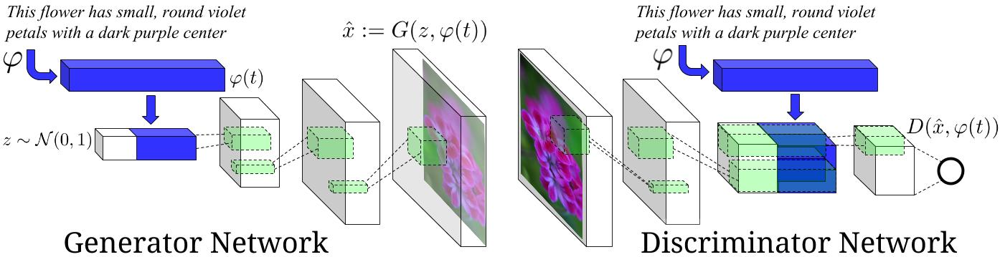

# text-to-image
Implement for [Kaggles Contest - Reverse Image Caption](https://www.kaggle.com/c/datalabcup-reverse-image-caption-ver2/leaderboard)
## Architecture
  

Using `GAN-CLS` algorithm from the paper [Generative Adversarial Text-to-Image Synthesis](http://arxiv.org/abs/1605.05396) and `stackGAN-stage1` from [StackGAN - Github](https://github.com/hanzhanggit/StackGAN)

## Prepare Data
Download image files and captions from [Google Drive](https://drive.google.com/drive/folders/1aUJrBoIN3l9U5p5pNXT0NeNzlyBWF54u?usp=sharing), put into `./text-to-image` directory

## Result ( After 800 epoch )
* the flower shown has yellow anther red pistil and bright red petals.
* this flower has petals that are yellow, white and purple and has dark lines
* the petals on this flower are white with a yellow center
* this flower has a lot of small round pink petals.
* this flower is orange in color, and has petals that are ruffled and rounded.
* the flower has yellow petals and the center of it is brown
* this flower has petals that are blue and white.
* these white flowers have petals that start off white in color and end in a white towards the tips.  

